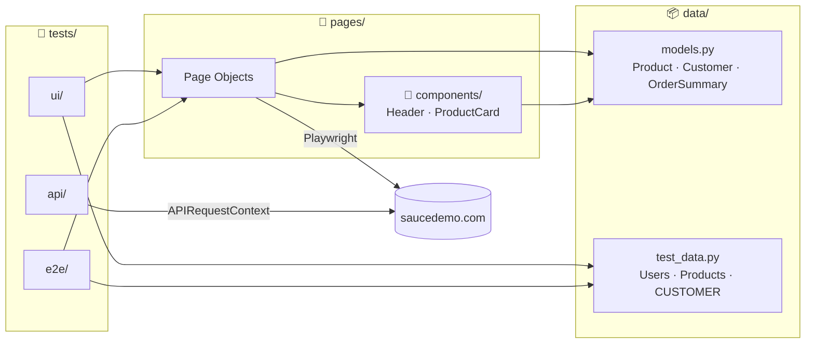
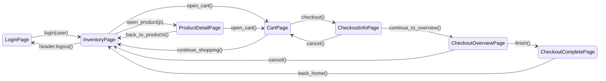
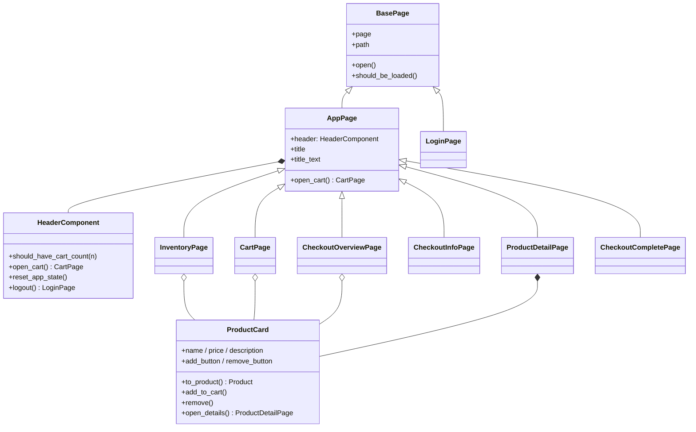
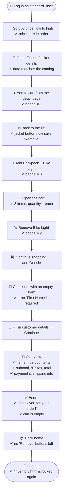
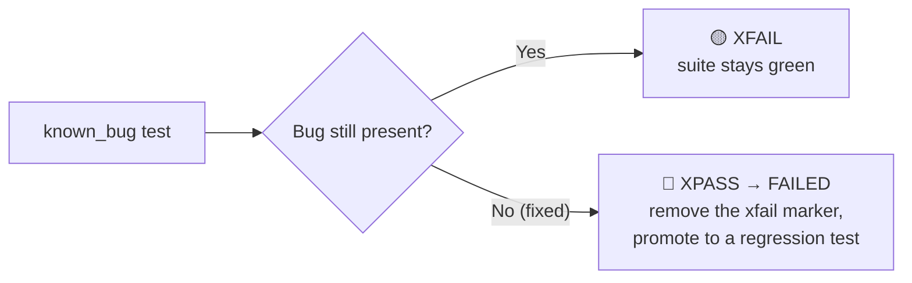

<div align="center">

# 🧪 Saucedemo Test Automation

**Playwright + pytest (Python) · UI, E2E & API · Page Object Model · GitHub Actions**

[](https://github.com/HivanA98/Playwright_Python/actions/workflows/tests.yml)


Automated tests for the **[saucedemo.com](https://www.saucedemo.com)** demo shop — from login and shopping all the way to checkout — running automatically on 3 browsers on every push.

[⚡ Quick Start](#-quick-start-60-seconds) · [🗺️ Architecture](#️-architecture-page-object-model) · [🛒 E2E Scenarios](#-e2e-scenarios) · [🐞 Known Bugs](#-known-bugs) · [⌨️ Cheat Sheet](#️-command-cheat-sheet) · [🤖 CI](#-github-actions)

</div>

---

## ⚡ Quick Start (60 seconds)

> [!TIP]
> Requires **Python 3.10+**. Use the copy icon on each code block and run them in order.

**1. Clone the repository**

```bash
git clone https://github.com/HivanA98/Playwright_Python.git
```

```bash
cd Playwright_Python
```

**2. Create a virtual environment**

```bash
python -m venv .venv
```

**3. Activate it** — pick your OS:

<details>
<summary>🪟 Windows (PowerShell)</summary>

```powershell
.venv\Scripts\Activate.ps1
```
</details>

<details>
<summary>🐧 Linux / 🍎 macOS</summary>

```bash
source .venv/bin/activate
```
</details>

**4. Install dependencies + browser**

```bash
pip install -r requirements.txt
```

```bash
python -m playwright install chromium
```

**5. Run all tests** 🚀

```bash
pytest -n auto
```

Expected result:

```text
======================= 45 passed, 7 xfailed in ~25s ========================
```

> [!NOTE]
> **7 xfailed is expected**, not an error — those tests cover bugs that Saucedemo ships on purpose. See [🐞 Known Bugs](#-known-bugs).

---

## 📊 What Is Tested?

| Suite | Marker | Count | Browser? | Covers |
|---|---|:-:|:-:|---|
| 🖥️ **UI** | `ui` | 26 | ✅ | Login, catalog, sorting, product details, form validation, network |
| 🛒 **E2E** | `e2e` | 12 | ✅ | Full shopping journeys across pages and users |
| 🐞 **Known bugs** | `e2e` + `known_bug` | 7 | ✅ | Saucedemo's deliberately buggy users (strict xfail) |
| 🌐 **API** | `api` | 7 | ❌ | HTTP contract: status, headers, manifest, assets |
| 🔥 **Smoke** | `smoke` | 4 | mixed | Critical subset for a quick check |

---

## 🗺️ Architecture (Page Object Model)

Tests **never** touch selectors directly. Every interaction goes through a *page object*, and all data goes through *models*.



### Fluent navigation: every action returns the next page



As a result, a shopping flow reads like a sentence:

```python
overview = (
    login_page.login(Users.STANDARD)
    .add_to_cart(Products.BACKPACK, Products.ONESIE)
    .open_cart()
    .checkout()
    .fill(CUSTOMER)
    .continue_to_overview()
)
assert overview.summary() == OrderSummary.expected_for([Products.BACKPACK, Products.ONESIE])
```

<details>
<summary>🔍 <b>Show the full class diagram</b></summary>


</details>

<details>
<summary>📐 <b>POM rules used in this project</b></summary>

| # | Rule | Why |
|:-:|---|---|
| 1 | Locators are defined once, in the page object's `__init__` | When the UI changes, you fix it in one place |
| 2 | Actions that change pages **return the next page object** | Tests read as a user journey, and the IDE can autocomplete |
| 3 | Every new page is verified with `should_be_loaded()` | Fails fast at the right step, not three steps later |
| 4 | Repeated UI pieces become **components** (`HeaderComponent`, `ProductCard`) | `ProductCard` is reused on 4 pages |
| 5 | Page objects return **models** (`Product`, `OrderSummary`), not strings | Tests compare business objects, not raw text |
| 6 | Money uses `Decimal`, not `float` | `0.1 + 0.2 != 0.3` can never make a test flaky |
| 7 | Assertions live in tests (except `should_*` helpers) | Page object = "how", test = "what is expected" |
</details>

<details>
<summary>📁 <b>Folder structure</b></summary>

```text
.
├── .github/workflows/tests.yml     # CI: API job + UI/E2E matrix (chromium/firefox/webkit)
├── conftest.py                     # Fixtures: login_page, inventory_page, api_context
├── data/
│   ├── models.py                   # Product, Customer, User, OrderSummary (+ 8% tax formula)
│   └── test_data.py                # Users, Products (catalog), CUSTOMER, payment info
├── pages/
│   ├── base_page.py                # BasePage + AppPage (pages behind login)
│   ├── components/
│   │   ├── header.py               # Burger menu, cart badge, logout, reset
│   │   └── product_card.py         # One product (used on inventory/detail/cart/overview)
│   ├── login_page.py
│   ├── inventory_page.py           # + SortOption enum
│   ├── product_detail_page.py
│   ├── cart_page.py
│   ├── checkout_info_page.py       # Step 1: customer details form
│   ├── checkout_overview_page.py   # Step 2: summary & totals
│   └── checkout_complete_page.py
├── tests/
│   ├── api/test_site_api.py
│   ├── ui/
│   │   ├── test_login.py
│   │   ├── test_inventory.py
│   │   ├── test_checkout_validation.py
│   │   └── test_network.py
│   └── e2e/
│       ├── test_purchase_journey.py
│       └── test_known_bugs.py
├── pytest.ini
└── requirements.txt
```
</details>

---

## 🛒 E2E Scenarios

### Full shopping journey — `test_complete_shopping_journey`



<details>
<summary>📋 <b>All E2E scenarios (12 tests)</b></summary>

| Test | What it proves |
|---|---|
| `test_complete_shopping_journey` | The 14-step flow above |
| `test_checkout_totals_per_user_and_basket` ×6 | **2 users** (`standard_user`, `performance_glitch_user`) × **3 baskets** (cheapest single item, two same-priced items, entire catalog) — overview items & totals are always correct |
| `test_entire_catalog_total_matches_known_value` | Pins the tax formula to real numbers: `$129.94 + $10.40 = $140.34` |
| `test_cancel_on_info_step_returns_to_cart_with_items` | Cancel on step 1 → back to the cart, contents intact |
| `test_cancel_on_overview_keeps_cart` | Cancel on step 2 → back to inventory, cart intact |
| `test_cart_persists_across_reload_and_pages` | Cart survives a reload and navigating to a detail page |
| `test_reset_app_state_empties_cart` | The *Reset App State* menu item empties the cart |
</details>

---

## 🐞 Known Bugs

Saucedemo has users that are **deliberately broken**. These tests assert the *correct* behavior and are marked `xfail(strict=True)`:



| User | Detected bug |
|---|---|
| `problem_user` | Sorting Z→A does not sort |
| `problem_user` | Every product image is the same (404 placeholder) |
| `problem_user` | Typing in *Last Name* overwrites *First Name* |
| `problem_user`, `error_user` | Some *Add to cart* buttons do nothing |
| `error_user` | The *Finish* button does not complete the order |
| `visual_user` | Inventory prices differ from the catalog |

---

## 🌐 About the API Tests

> [!IMPORTANT]
> Saucedemo is a static SPA hosted on GitHub Pages — **it has no public REST API**.

So `tests/api/` checks the HTTP contract the server actually serves, using Playwright's `APIRequestContext` (no browser): status codes, `content-type`, `ETag`/`cache-control`, the HTML shell, `manifest.json` and its icons, the JS/CSS bundles, the 404 page, and response time. `tests/ui/test_network.py` combines UI and network: it watches for failed requests and blocks images with `page.route`.

---

## ⌨️ Command Cheat Sheet

| I want to… | Command |
|---|---|
| Run all tests (in parallel) | `pytest -n auto` |
| Run only smoke tests | `pytest -m smoke` |
| Run only E2E | `pytest -m e2e` |
| Run UI + E2E without known bugs | `pytest -m "(ui or e2e) and not known_bug"` |
| Run only API (no browser) | `pytest -m api` |
| Run one file / one test | `pytest tests/e2e/test_purchase_journey.py::test_complete_shopping_journey` |
| Find tests by name | `pytest -k checkout` |
| **Watch the browser in action** 👀 | `pytest -m smoke --headed --slowmo 500` |
| Use another browser | `pytest --browser firefox` · `--browser webkit` |
| Generate an HTML report | `pytest --html=reports/report.html --self-contained-html` |
| List tests without running them | `pytest --collect-only -q` |
| Debug step by step | `PWDEBUG=1 pytest -k complete_shopping` |

<details>
<summary>🔬 <b>Investigating a failed test (trace viewer)</b></summary>

When a test fails, a screenshot, a video and a **trace** are saved automatically to `test-results/`. The trace contains a timeline of every action, DOM snapshots, network and console output:

```bash
python -m playwright show-trace test-results/<test-name>/trace.zip
```

Or drag and drop `trace.zip` onto **[trace.playwright.dev](https://trace.playwright.dev)** — no install needed. The same files are available as artifacts in GitHub Actions.
</details>

<details>
<summary>⚙️ <b>Configuration via environment variables</b></summary>

| Variable | Default | Purpose |
|---|---|---|
| `BASE_URL` | `https://www.saucedemo.com` | Point the tests at another environment |
| `SAUCE_PASSWORD` | `secret_sauce` | Password for all test users |
</details>

---

## ✍️ Adding a New Test (Example)

Say you want to test: *"removing an item from the detail page decreases the badge"*.

<details>
<summary><b>Step 1</b> — Check whether the page object already has the action</summary>

`ProductDetailPage` already has `add_to_cart()` and `remove()`, and the header has `should_have_cart_count()`. No new selectors needed. If something is missing, add the locator in `__init__` and the method in the matching page object — **not** in the test.
</details>

<details>
<summary><b>Step 2</b> — Write the test using fixtures + data</summary>

```python
# tests/ui/test_product_detail.py
import pytest
from data import Products

pytestmark = pytest.mark.ui


def test_remove_from_detail_updates_badge(inventory_page):
    detail = inventory_page.open_product(Products.BACKPACK).add_to_cart()
    detail.header.should_have_cart_count(1)

    detail.remove()

    detail.header.should_have_cart_count(0)
```
</details>

<details>
<summary><b>Step 3</b> — Run it and watch</summary>

```bash
pytest tests/ui/test_product_detail.py --headed --slowmo 500
```
</details>

**Available fixtures:**

| Fixture | Provides | Notes |
|---|---|---|
| `login_page` | An opened `LoginPage` | For tests that log in through the form |
| `inventory_page` | `InventoryPage` as `standard_user` | **Instant** login via cookie, no form |
| `logged_in_page` | A logged-in Playwright `Page` | For custom setup (e.g. `page.route`) |
| `api_context` | `APIRequestContext` | For HTTP tests without a browser |

---

## 🤖 GitHub Actions


- UI/E2E tests run in parallel (`-n auto`) with 1 *rerun* to reduce flakiness.
- **Manual run:** **Actions** tab → **Tests** → **Run workflow** → enter a *marker* (e.g. `smoke`, `e2e`, or `ui and not known_bug`).
- Latest runs: [github.com/HivanA98/Playwright_Python/actions](https://github.com/HivanA98/Playwright_Python/actions)

---

## ❓ Troubleshooting

<details>
<summary><code>playwright: command not found</code> / browser not found</summary>

Use `python -m playwright ...` instead of `playwright ...`, then install the browser:

```bash
python -m playwright install chromium
```
</details>

<details>
<summary>I see <code>xfailed</code> — are my tests broken?</summary>

No. Those are the tests in `tests/e2e/test_known_bugs.py` for bugs Saucedemo ships on purpose. What to watch for is an **XPASS/FAILED** in that file — it means a bug was fixed and the test needs updating.
</details>

<details>
<summary><code>performance_glitch_user</code> tests are slow</summary>

That's expected — this user is deliberately ~5 seconds slow to log in. The `expect` timeout is set to 15 seconds in `conftest.py` to accommodate it.
</details>

<details>
<summary>A selector suddenly can't be found</summary>

Saucedemo occasionally updates its UI. All selectors live in `pages/` and use the `data-test` attribute, so you only fix the relevant page object — tests stay unchanged. Run with `--headed --slowmo 500` or open the trace to see the page state.
</details>
