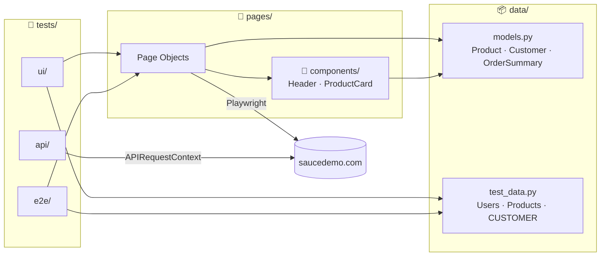
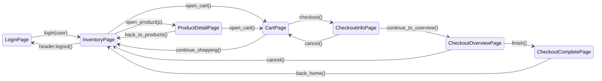
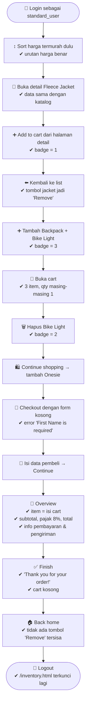
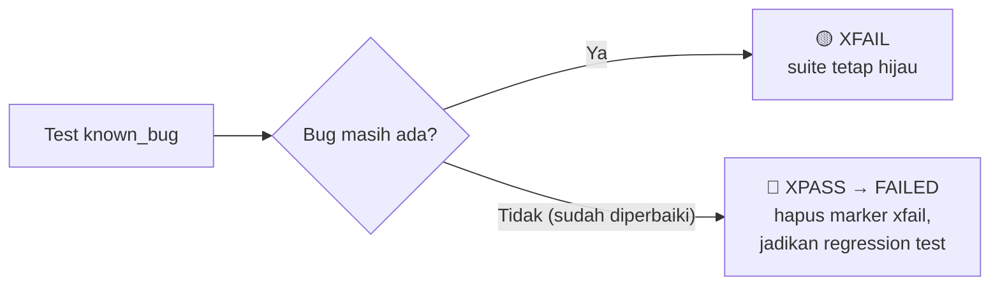
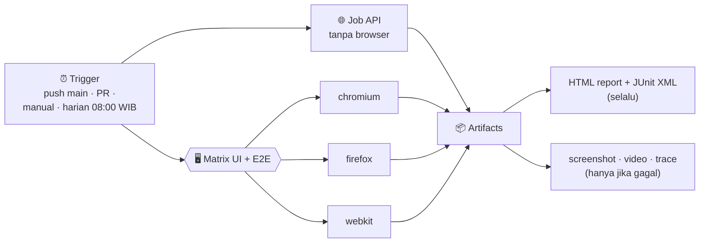

<div align="center">

# 🧪 Saucedemo Test Automation

**Playwright + pytest (Python) · UI, E2E & API · Page Object Model · GitHub Actions**

[](https://github.com/<username>/Playwright_Python/actions/workflows/tests.yml)


Test otomatis untuk toko demo **[saucedemo.com](https://www.saucedemo.com)** — dari login, belanja, sampai checkout — dijalankan otomatis di 3 browser setiap ada push.

[⚡ Quick Start](#-quick-start-60-detik) · [🗺️ Arsitektur](#️-arsitektur-page-object-model) · [🛒 Skenario E2E](#-skenario-e2e) · [🐞 Known Bugs](#-known-bugs) · [⌨️ Cheat Sheet](#️-cheat-sheet-perintah) · [🤖 CI](#-github-actions)

</div>

---

## ⚡ Quick Start (60 detik)

> [!TIP]
> Butuh **Python 3.10+**. Klik ikon salin di pojok tiap blok kode, lalu jalankan berurutan.

**1. Buat virtual environment**

```bash
python -m venv .venv
```

**2. Aktifkan** — pilih sesuai OS:

<details>
<summary>🪟 Windows (PowerShell)</summary>

```powershell
.venv\Scripts\Activate.ps1
```
</details>

<details>
<summary>🐧 Linux / 🍎 macOS</summary>

```bash
source .venv/bin/activate
```
</details>

**3. Install dependensi + browser**

```bash
pip install -r requirements.txt
```

```bash
python -m playwright install chromium
```

**4. Jalankan semua test** 🚀

```bash
pytest -n auto
```

Hasil yang diharapkan:

```text
======================= 45 passed, 7 xfailed in ~25s ========================
```

> [!NOTE]
> **7 xfailed itu normal**, bukan error — itu test untuk bug yang memang sengaja ada di Saucedemo. Lihat [🐞 Known Bugs](#-known-bugs).

---

## 📊 Apa yang Diuji?

| Suite | Marker | Jumlah | Butuh browser? | Isi |
|---|---|:-:|:-:|---|
| 🖥️ **UI** | `ui` | 26 | ✅ | Login, katalog, sorting, detail produk, validasi form, network |
| 🛒 **E2E** | `e2e` | 12 | ✅ | Perjalanan belanja lengkap lintas halaman & user |
| 🐞 **Known bugs** | `e2e` + `known_bug` | 7 | ✅ | Bug bawaan user khusus Saucedemo (xfail strict) |
| 🌐 **API** | `api` | 7 | ❌ | Kontrak HTTP: status, header, manifest, aset |
| 🔥 **Smoke** | `smoke` | 4 | campuran | Subset kritis untuk cek cepat |

---

## 🗺️ Arsitektur (Page Object Model)

Test **tidak pernah** menyentuh selector secara langsung. Semua interaksi lewat *page object*, dan semua data lewat *model*.



### Navigasi fluent: tiap aksi mengembalikan halaman berikutnya



Hasilnya, satu alur belanja bisa ditulis seperti kalimat:

```python
overview = (
    login_page.login(Users.STANDARD)
    .add_to_cart(Products.BACKPACK, Products.ONESIE)
    .open_cart()
    .checkout()
    .fill(CUSTOMER)
    .continue_to_overview()
)
assert overview.summary() == OrderSummary.expected_for([Products.BACKPACK, Products.ONESIE])
```

<details>
<summary>🔍 <b>Lihat diagram kelas lengkap</b></summary>


</details>

<details>
<summary>📐 <b>Aturan POM yang dipakai di project ini</b></summary>

| # | Aturan | Kenapa |
|:-:|---|---|
| 1 | Locator didefinisikan sekali di `__init__` page object | Kalau UI berubah, cukup ubah 1 tempat |
| 2 | Aksi yang pindah halaman **mengembalikan page object berikutnya** | Test terbaca sebagai alur user, IDE bisa autocomplete |
| 3 | Setiap halaman baru diverifikasi dengan `should_be_loaded()` | Gagal cepat di langkah yang tepat, bukan 3 langkah kemudian |
| 4 | Bagian UI yang berulang jadi **component** (`HeaderComponent`, `ProductCard`) | `ProductCard` dipakai ulang di 4 halaman |
| 5 | Page object mengembalikan **model** (`Product`, `OrderSummary`), bukan string | Test membandingkan objek bisnis, bukan teks mentah |
| 6 | Uang pakai `Decimal`, bukan `float` | `0.1 + 0.2 != 0.3` tidak akan bikin test flaky |
| 7 | Assertion tetap di test (kecuali `should_*` helper) | Page object = "cara", test = "apa yang diharapkan" |
</details>

<details>
<summary>📁 <b>Struktur folder</b></summary>

```text
.
├── .github/workflows/tests.yml     # CI: job API + matrix UI/E2E (chromium/firefox/webkit)
├── conftest.py                     # Fixtures: login_page, inventory_page, api_context
├── data/
│   ├── models.py                   # Product, Customer, User, OrderSummary (+ rumus pajak 8%)
│   └── test_data.py                # Users, Products (katalog), CUSTOMER, info pembayaran
├── pages/
│   ├── base_page.py                # BasePage + AppPage (halaman setelah login)
│   ├── components/
│   │   ├── header.py               # Menu burger, badge keranjang, logout, reset
│   │   └── product_card.py         # Satu produk (dipakai di inventory/detail/cart/overview)
│   ├── login_page.py
│   ├── inventory_page.py           # + SortOption enum
│   ├── product_detail_page.py
│   ├── cart_page.py
│   ├── checkout_info_page.py       # Step 1: form data pembeli
│   ├── checkout_overview_page.py   # Step 2: ringkasan & total
│   └── checkout_complete_page.py
├── tests/
│   ├── api/test_site_api.py
│   ├── ui/
│   │   ├── test_login.py
│   │   ├── test_inventory.py
│   │   ├── test_checkout_validation.py
│   │   └── test_network.py
│   └── e2e/
│       ├── test_purchase_journey.py
│       └── test_known_bugs.py
├── pytest.ini
└── requirements.txt
```
</details>

---

## 🛒 Skenario E2E

### Perjalanan belanja lengkap — `test_complete_shopping_journey`



<details>
<summary>📋 <b>Semua skenario E2E (12 test)</b></summary>

| Test | Yang dibuktikan |
|---|---|
| `test_complete_shopping_journey` | Alur 14 langkah di atas |
| `test_checkout_totals_per_user_and_basket` ×6 | **2 user** (`standard_user`, `performance_glitch_user`) × **3 keranjang** (1 item termurah, 2 item harga sama, seluruh katalog) — item & total di overview selalu benar |
| `test_entire_catalog_total_matches_known_value` | Mengunci rumus pajak ke angka nyata: `$129.94 + $10.40 = $140.34` |
| `test_cancel_on_info_step_returns_to_cart_with_items` | Cancel di step 1 → kembali ke cart, isi tetap |
| `test_cancel_on_overview_keeps_cart` | Cancel di step 2 → kembali ke inventory, cart tetap |
| `test_cart_persists_across_reload_and_pages` | Cart bertahan setelah reload & pindah ke halaman detail |
| `test_reset_app_state_empties_cart` | Menu *Reset App State* mengosongkan cart |
</details>

---

## 🐞 Known Bugs

Saucedemo punya user yang **sengaja dibuat bermasalah**. Test-nya menuliskan perilaku yang *benar* dan diberi `xfail(strict=True)`:



| User | Bug yang terdeteksi |
|---|---|
| `problem_user` | Sort Z→A tidak mengurutkan |
| `problem_user` | Semua gambar produk sama (placeholder 404) |
| `problem_user` | Mengetik *Last Name* malah menimpa *First Name* |
| `problem_user`, `error_user` | Sebagian tombol *Add to cart* tidak berfungsi |
| `error_user` | Tombol *Finish* tidak menyelesaikan order |
| `visual_user` | Harga di inventory beda dengan katalog |

---

## 🌐 Tentang API Test

> [!IMPORTANT]
> Saucedemo adalah SPA statis di GitHub Pages — **tidak punya REST API publik**.

Jadi `tests/api/` menguji kontrak HTTP yang benar-benar disajikan server memakai `APIRequestContext` Playwright (tanpa browser): status code, `content-type`, `ETag`/`cache-control`, HTML shell, `manifest.json` + ikonnya, bundle JS/CSS, halaman 404, dan waktu respons. `tests/ui/test_network.py` menggabungkan UI + network: memantau request gagal dan memblokir gambar dengan `page.route`.

---

## ⌨️ Cheat Sheet Perintah

| Saya ingin… | Perintah |
|---|---|
| Jalankan semua test (paralel) | `pytest -n auto` |
| Hanya smoke test | `pytest -m smoke` |
| Hanya E2E | `pytest -m e2e` |
| UI + E2E tanpa known bugs | `pytest -m "(ui or e2e) and not known_bug"` |
| Hanya API (tanpa browser) | `pytest -m api` |
| Satu file / satu test | `pytest tests/e2e/test_purchase_journey.py::test_complete_shopping_journey` |
| Cari test berdasarkan nama | `pytest -k checkout` |
| **Lihat browser-nya bergerak** 👀 | `pytest -m smoke --headed --slowmo 500` |
| Browser lain | `pytest --browser firefox` · `--browser webkit` |
| Laporan HTML | `pytest --html=reports/report.html --self-contained-html` |
| Lihat semua test tanpa menjalankan | `pytest --collect-only -q` |
| Debug langkah demi langkah | `PWDEBUG=1 pytest -k complete_shopping` |

<details>
<summary>🔬 <b>Investigasi test yang gagal (trace viewer)</b></summary>

Saat test gagal, screenshot, video, dan **trace** otomatis disimpan di `test-results/`. Trace berisi timeline setiap aksi, snapshot DOM, network, dan console:

```bash
python -m playwright show-trace test-results/<nama-test>/trace.zip
```

Atau drag & drop `trace.zip` ke **[trace.playwright.dev](https://trace.playwright.dev)** — tidak perlu install apa pun. File yang sama juga tersedia sebagai artifact di GitHub Actions.
</details>

<details>
<summary>⚙️ <b>Konfigurasi lewat environment variable</b></summary>

| Variabel | Default | Kegunaan |
|---|---|---|
| `BASE_URL` | `https://www.saucedemo.com` | Arahkan test ke environment lain |
| `SAUCE_PASSWORD` | `secret_sauce` | Password semua test user |
</details>

---

## ✍️ Menambah Test Baru (Contoh)

Misal ingin menguji: *"menghapus item dari halaman detail mengurangi badge"*.

<details>
<summary><b>Langkah 1</b> — Cek apakah page object sudah punya aksinya</summary>

`ProductDetailPage` sudah punya `add_to_cart()` dan `remove()`, dan header punya `should_have_cart_count()`. Tidak perlu menulis selector baru. Kalau belum ada, tambahkan locator di `__init__` dan method-nya di page object yang sesuai — **jangan** di test.
</details>

<details>
<summary><b>Langkah 2</b> — Tulis test memakai fixture + data</summary>

```python
# tests/ui/test_product_detail.py
import pytest
from data import Products

pytestmark = pytest.mark.ui


def test_remove_from_detail_updates_badge(inventory_page):
    detail = inventory_page.open_product(Products.BACKPACK).add_to_cart()
    detail.header.should_have_cart_count(1)

    detail.remove()

    detail.header.should_have_cart_count(0)
```
</details>

<details>
<summary><b>Langkah 3</b> — Jalankan & lihat</summary>

```bash
pytest tests/ui/test_product_detail.py --headed --slowmo 500
```
</details>

**Fixture yang tersedia:**

| Fixture | Memberi | Catatan |
|---|---|---|
| `login_page` | `LoginPage` yang sudah dibuka | Untuk test yang login lewat form |
| `inventory_page` | `InventoryPage` sebagai `standard_user` | Login **instan** via cookie, tanpa isi form |
| `logged_in_page` | `Page` Playwright yang sudah login | Untuk setup custom (mis. `page.route`) |
| `api_context` | `APIRequestContext` | Untuk test HTTP tanpa browser |

---

## 🤖 GitHub Actions



- Test UI/E2E berjalan paralel (`-n auto`) dengan 1× *rerun* untuk mengurangi flaky.
- **Menjalankan manual:** tab **Actions** → **Tests** → **Run workflow** → isi *marker* (mis. `smoke`, `e2e`, atau `ui and not known_bug`).
- Ganti `<username>` di badge paling atas dengan username GitHub Anda agar status CI tampil.

---

## ❓ Troubleshooting

<details>
<summary><code>playwright: command not found</code> / browser tidak ditemukan</summary>

Pakai `python -m playwright ...` alih-alih `playwright ...`, lalu install browser-nya:

```bash
python -m playwright install chromium
```
</details>

<details>
<summary>Muncul <code>xfailed</code> — apakah test saya rusak?</summary>

Tidak. Itu test di `tests/e2e/test_known_bugs.py` untuk bug yang memang disengaja oleh Saucedemo. Yang perlu diwaspadai adalah **XPASS/FAILED** di file itu — artinya bug sudah diperbaiki dan test perlu diperbarui.
</details>

<details>
<summary>Test <code>performance_glitch_user</code> lambat</summary>

Normal — user itu sengaja dibuat lambat ±5 detik saat login. Timeout `expect` diset 15 detik di `conftest.py` untuk mengakomodasinya.
</details>

<details>
<summary>Selector tiba-tiba tidak ditemukan</summary>

Saucedemo kadang memperbarui tampilannya. Semua selector ada di `pages/` dan memakai atribut `data-test`, jadi cukup perbaiki di page object terkait — test tidak perlu diubah. Jalankan dengan `--headed --slowmo 500` atau buka trace untuk melihat kondisi halaman.
</details>
